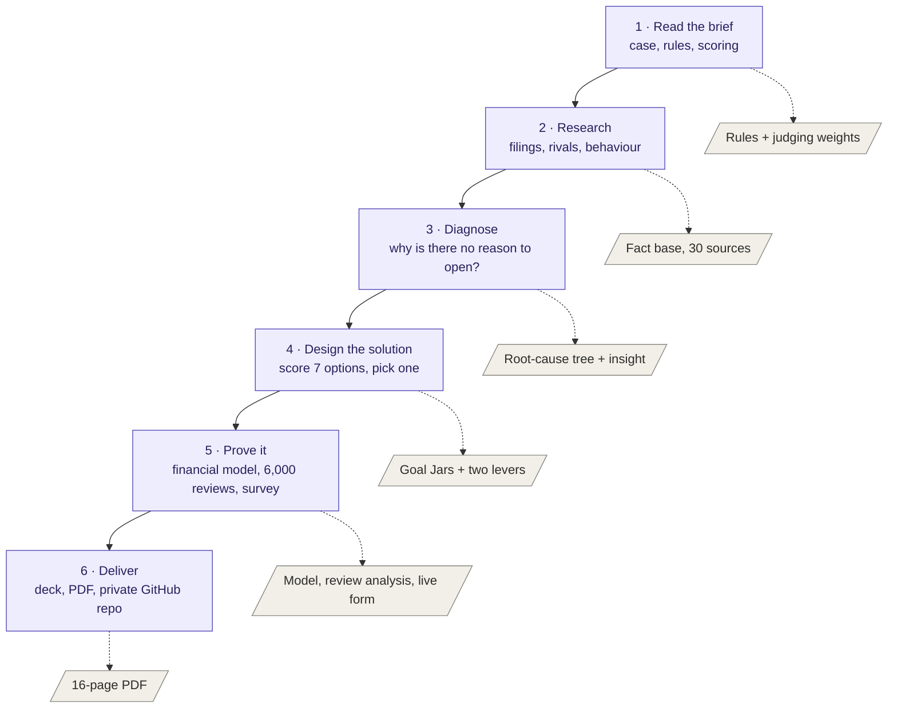
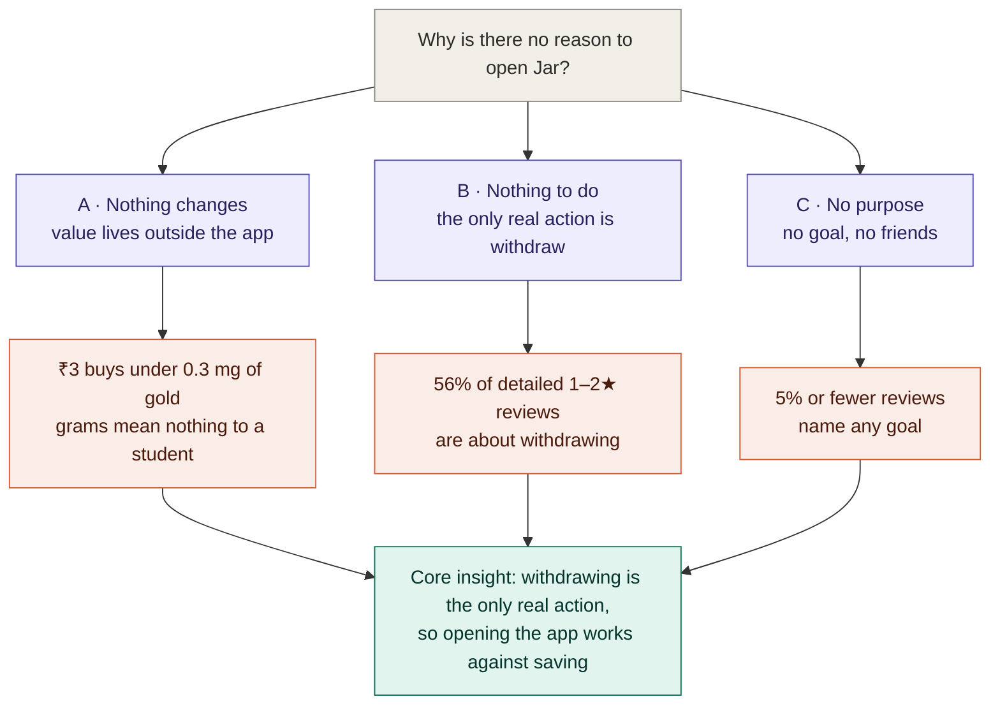
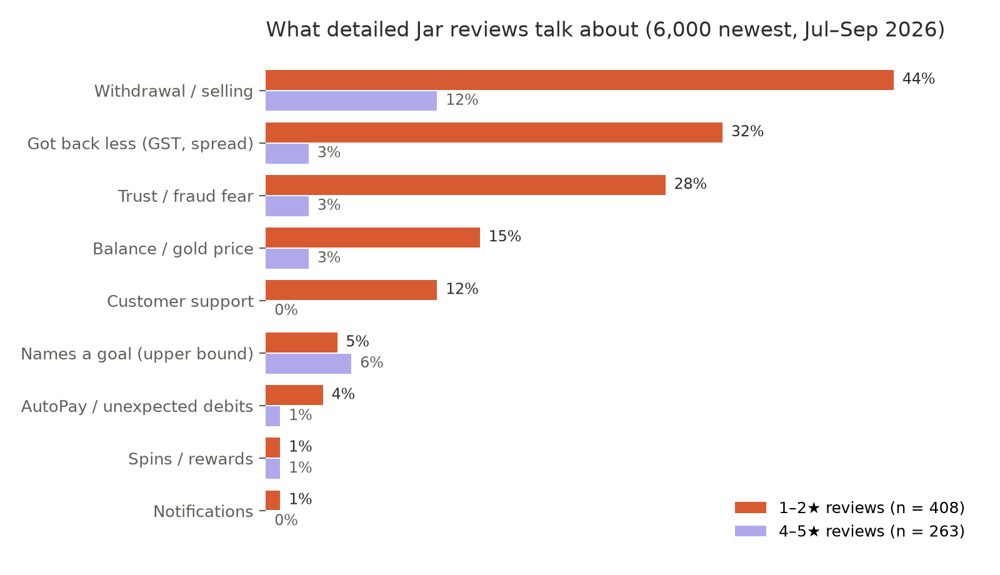
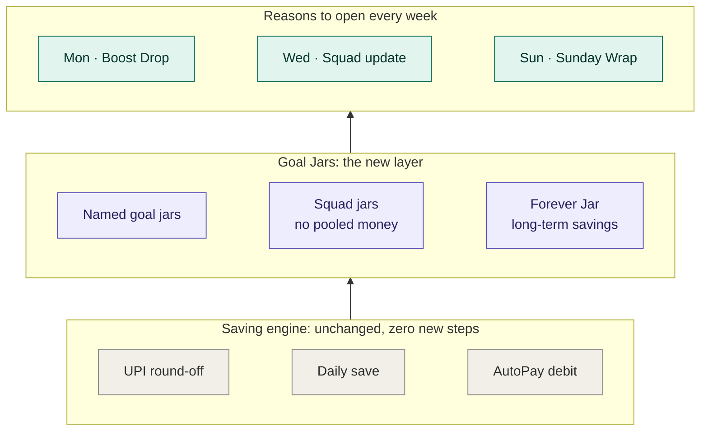
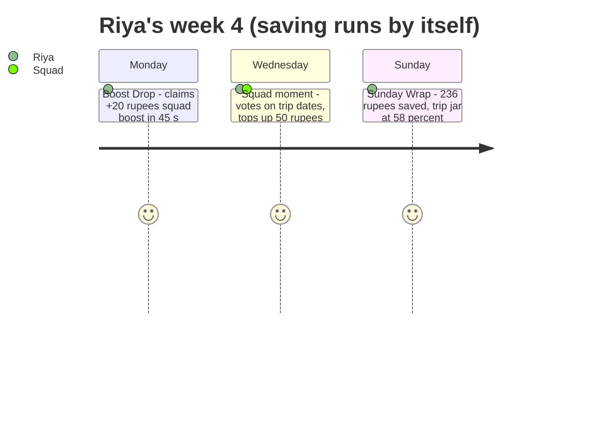
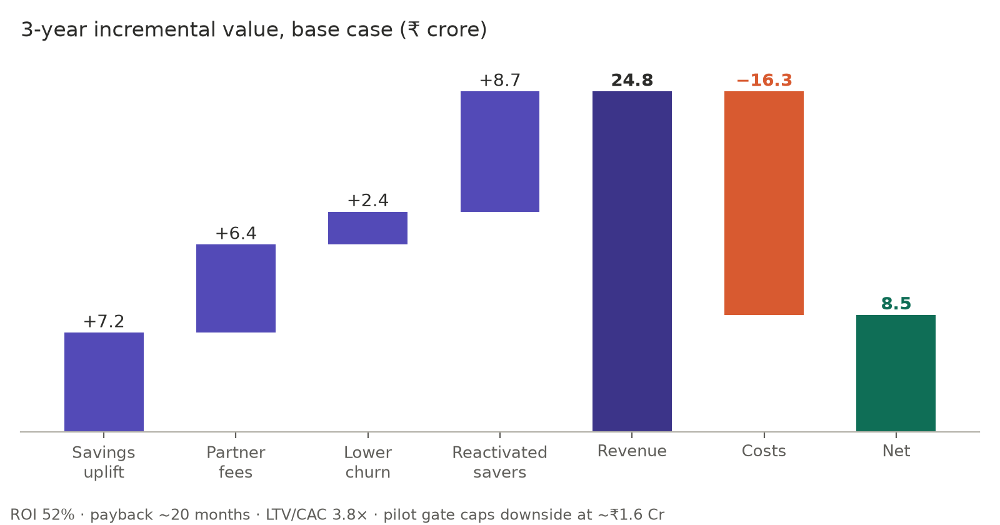
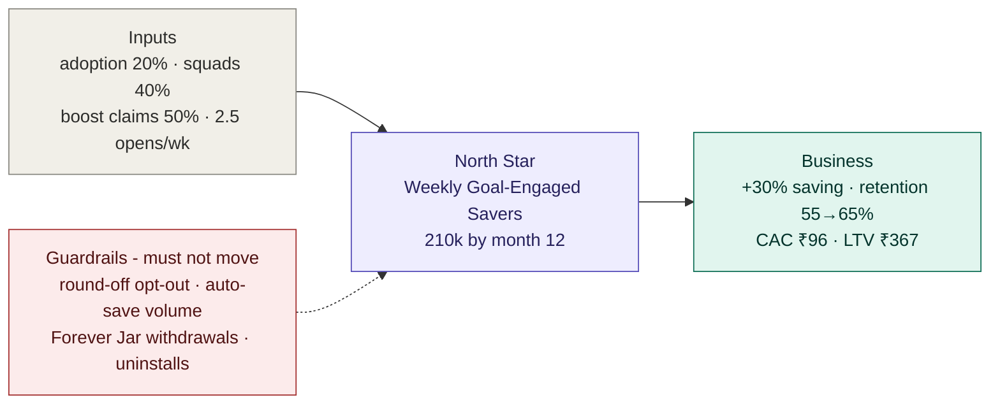
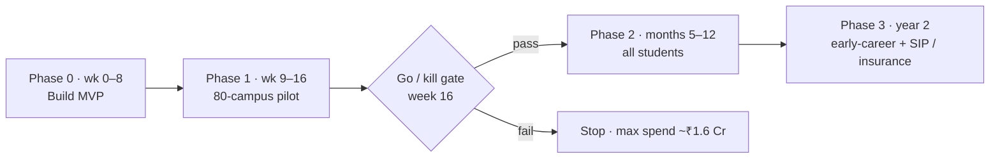
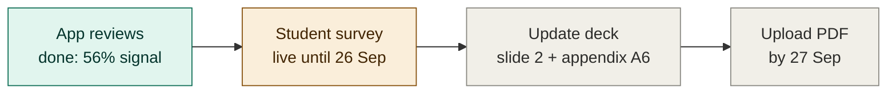
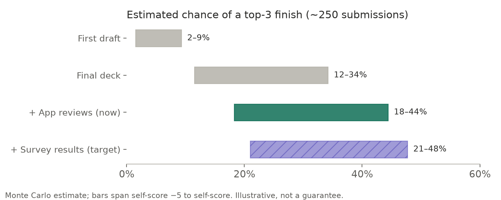

# Give every rupee a job: CaseBlitz 2026, Jar case

**Team HAVOC · CV Raman University** · CaseBlitz 2026 (Product Management Club & 180 Degrees Consulting, IIT ISM Dhanbad; case partner: The Product Folks)

> **The case in one line:** Jar saves money automatically, so students never need to open the app. How do we give them a genuine reason to open it 2–3 times a week without breaking the automatic saving habit?
>
> **Our answer:** **Goal Jars** with **Squads**, **Monday Brand Boosts** and a **Sunday Wrap**. This is a new layer on top of Jar's saving engine, which stays unchanged, and it gives students three decisions worth coming back for each week.

| | |
|---|---|
| **Submission** | [`HAVOC_CVRamanUniversity.pdf`](HAVOC_CVRamanUniversity.pdf): 7 content slides + title, thank-you and appendix A1–A7 |
| **Core insight** | Jar automated every decision except the one it doesn't want users to make. Today the only meaningful in-app action is to **withdraw** |
| **Headline numbers** | ₹8.5 Cr 3-year net (base) · 52% ROI · ~20-month payback · LTV/CAC 3.8× · downside capped at ~₹1.6 Cr |
| **Evidence** | 30 sources · 6,000 Play Store reviews analysed · live student survey |

---

## Contents
1. [The brief](#1-the-brief)
2. [How we worked](#2-how-we-worked)
3. [Research highlights](#3-research-highlights)
4. [Diagnosis](#4-diagnosis-25)
5. [Evidence from real users](#5-evidence-from-real-users)
6. [The solution](#6-the-solution-25)
7. [User journey](#7-user-journey-20)
8. [Business case](#8-business-case-20)
9. [Metrics and rollout](#9-metrics-and-rollout)
10. [Validation: student survey](#10-validation-student-survey)
11. [Confidence score](#11-confidence-score)
12. [Deck map](#12-deck-map)
13. [Repo structure and how to reproduce](#13-repo-structure-and-how-to-reproduce)

---

## 1. The brief

Jar rounds up everyday UPI payments (a ₹47 chai becomes ₹50) and invests the spare change in 24K digital gold. The problem statement calls the result **"Silent Saver" syndrome**:

| Symptom | What it means |
|---|---|
| Set-and-forget loop | Saving happens in the background, so the app becomes invisible |
| Shallow relationship | No reason to cross-sell SIPs, loans or loyalty, and no defence if PhonePe or GPay copies round-off |
| No "reason to open" | Unlike Duolingo (streaks), nothing in Jar pulls a student back |

**Rules:** max 7 content slides (the title, thank-you and appendix slides don't count) · PDF · due 28 Sep 2026, 11:59 PM · every assumption must be stated.

| Criterion | Weight |
|---|---|
| Diagnosis | 25% |
| Solution | 25% |
| User journey | 20% |
| Business impact | 20% |
| Design | 10% |

---

## 2. How we worked



---

## 3. Research highlights

| Fact | Value | Source |
|---|---|---|
| Registered users | 35M+ across 12,000 pin codes; >95% first-time savers; ~60% tier-2/3 | TechCrunch, Entrackr |
| FY25 revenue | ₹208 Cr operating (net) · ₹2,450 Cr gross · profitable in Q4 FY25 and Q1 FY26 | Entrackr, Inc42 |
| Monthly active savers | ~6.8% of registered users (Mar 2024) → **~12.5%** estimated today | Derived from Deccan Chronicle + Inc42 |
| Competitive threat | **Paytm Gold Coins** (2025) give gold on every payment, so the "gold from payments" idea has already been copied | Business Today |
| Regulatory | SEBI advisory (Nov 2025): digital gold is **not SEBI-regulated** | MediaNama |
| Behavioural science | Labelling savings for a purpose and splitting them into envelopes raised savings **+72%** in an Indian field study | Soman & Cheema (2011) |
| What failed | Fello's prize-pool gamified saving pivoted to advisory because the prizes were too expensive | Mani Karthik |

All sources are listed in the deck's appendix A5 and in [`Jar_CaseBlitz_Strategy_Dossier.md`](Jar_CaseBlitz_Strategy_Dossier.md).

---

## 4. Diagnosis (25%)

Why does a passive saver have no reason to open the app? We split the causes into three groups that don't overlap, backed each with evidence, and combined them into one insight:



**What it is not:** trust (4.7★ from 112k ratings) · a lack of gamification (spins already exist) · too few notifications · Gen Z disliking gold.

**Who matters most:** *near-goal students* with 1–6 month goals (trips, phones, fests), about **1.75M active-saving students** (35M × 40% students [assumed] × 12.5% active [derived]).

---

## 5. Evidence from real users

We didn't want to rely on assumptions alone, so we pulled Jar's **6,000 newest Google Play reviews** (30 Jul – 22 Sep 2026) and keyword-coded the 684 detailed ones, in English and Hinglish:



- **56%** of detailed 1–2★ reviews are about the withdrawal moment: people withdraw and discover they get back less.
- Withdrawal is when users run into **3% GST + a 2–5% buy/sell spread**, so the one visible moment of value arrives as a *loss*.
- Only **≤5%** name any goal, and **1%** mention spins or rewards.

**Caveats:** people who write reviews skew towards complaints, the reviews aren't from students only, and keyword coding is approximate. This is directional evidence, not a survey. Reviewer names were removed; see [`reviews/`](reviews/).

---

## 6. The solution (25%)

We scored seven options (1–5 on impact, feasibility, fit, originality, safety for automatic saving, and defensibility):

| Option | Total /30 | Role |
|---|---|---|
| **A. Goal Jars + Squad Jars** | **26** | Core |
| **B. Brand Boosts** | **24** | Lever |
| **C. Sunday Wrap** | **22** | Lever |
| D. Streaks + campus leagues | 17 | Rejected: an automatic saving streak isn't earned |
| E. Campus gold-cashback | 17 | Rejected: Paytm Gold Coins already exists |
| F. Bigger prize games | 14 | Rejected: Fello's economics failed; Jar has spins already |
| G. Gold+ leasing yield | 13 | Rejected: Gullak has it; adds regulatory risk |

How the winner fits on top of Jar:



| Safe by design | Why it matters |
|---|---|
| No pooled money | Each squad member owns their own gold, which avoids "unauthorized collection" risk |
| Asset-agnostic ledger | A jar can hold gold ETF or fund units if digital gold gets restricted |
| Forever Jar partition | Protects long-term savings from goal withdrawals |
| Partner-funded boosts | Brands pay (the Acorns "Found Money" model); Jar's subsidy is capped at ₹25/user/yr |
| **Fixes the most painful moment** | Withdrawal becomes **goal redemption with a partner bonus** that offsets the spread |

---

## 7. User journey (20%)

**Persona:** Riya, 20, B.Com student in Indore · ~45 UPI payments a month · ₹1,200 sitting idle in Jar · goal: a Rishikesh trip with 3 friends, ₹4,000 each, in 12 weeks.



| Stage | What happens | Progress |
|---|---|---|
| Week 1: hook | Idle ₹1,200 seeds the jar, a 30% head start; invites 3 friends (1 dormant user reactivated) | 30% |
| Week 4: habit | Monday, Wednesday and Sunday rituals; raises daily save from ₹10 to ₹20 after the Wrap shows she's behind | 58% |
| Week 12: payoff | Redeems at a partner with a +5% bonus, adds trip insurance, starts the next jar in one tap | 100% |

**Why these aren't forced opens:** every open involves a decision that's worth something to her (money, coordination or progress), and each one still works with notifications off.

---

## 8. Business case (20%)



| Scenario | 3-yr revenue | 3-yr cost | 3-yr net | ROI | LTV/CAC |
|---|---|---|---|---|---|
| Bear (every adverse input at once) | ₹3.6 Cr | ₹14.5 Cr | −₹10.9 Cr → **capped at ~₹1.6 Cr by the pilot gate** | −75% | 0.4× |
| **Base** | **₹24.8 Cr** | **₹16.3 Cr** | **₹8.5 Cr** | **52%** | **3.8×** |
| Bull (+ early-career users from year 2) | ₹96.4 Cr | ₹18.3 Cr | ₹78.1 Cr | 428% | 13.5× |

**Biggest sensitivities:** adoption (swing of ₹21.6 Cr), take rate (₹16.5 Cr) and squad reactivation (₹10.5 Cr). **Break-even:** 21% of active-saving students adopting by year 3. Not counted in the ROI: ~₹25 Cr/yr of student margin defended against copycats.

The model is [`model/jar_goal_jars_model.py`](model/jar_goal_jars_model.py); every input is tagged sourced, derived or assumed.

---

## 9. Metrics and rollout





---

## 10. Validation: student survey

A 3-minute anonymous Google Form built with [`survey/create_survey_form.gs`](survey/create_survey_form.gs). People who don't use Jar skip the Jar-specific questions automatically, and the rest is worded so anyone can answer.

**Share link:** https://forms.gle/pTX1kXweo1EWahgV7



To analyse the results, run `summarizeResponses()` in the Apps Script project. It writes a **Summary** tab with headline numbers split into All / Jar users / non-users.

---

## 11. Confidence score

We estimate the odds of placing by scoring the deck against the judging criteria and simulating a field of about 250 submissions (821 teams registered on Unstop). Everything is in [`model/confidence_score_sim.py`](model/confidence_score_sim.py).



| Criterion | Score /10 |
|---|---|
| Diagnosis | 7.5 |
| Solution | 7.75 |
| User journey | 8 |
| Business impact | 7 |
| Design | 7.5 |
| **Quality score** | **~76 / 100** |

These are illustrative estimates. The field size and competitor quality are assumptions.

---

## 12. Deck map

| # | Slide | Main visual |
|---|---|---|
| — | Title | Filling jars |
| 1 | Executive summary | Problem banner + diagnosis / solution / impact cards |
| 2 | Research & diagnosis | Root-cause tree, core insight, evidence tiles |
| 3 | Where to play & what to build | Segment 2×2 + option scoring heat-map |
| 4 | Strategic recommendation | 3 phone mockups + zero-friction table |
| 5 | User journey | Riya's week-4 swimlane + hook → habit → payoff |
| 6 | Financial analysis | Waterfall, sensitivity chart, scenarios, KPIs |
| 7 | Metrics & rollout | North Star tree, guardrails, go/kill gate |
| — | Thank you | — |
| A1–A7 | Appendix | Assumptions · model · competitors · risks · sources · validation plan · review analysis |

---

## 13. Repo structure and how to reproduce

```
.
├── HAVOC_CVRamanUniversity.pdf / .pptx   ← submission
├── Jar_CaseBlitz_Strategy_Dossier.md     ← full reasoning, all 9 phases
├── deck/build_deck.js                    ← generates the deck (pptxgenjs)
├── model/
│   ├── jar_goal_jars_model.py            ← 3-year business case + sensitivity
│   └── confidence_score_sim.py           ← Monte Carlo placement odds
├── reviews/
│   ├── jar_playstore_reviews.json        ← 6,000 reviews (names removed)
│   └── analyze_reviews.py                ← theme coding
├── survey/
│   ├── create_survey_form.gs             ← Google Form builder + summary
│   └── README.md                         ← how to run the survey
└── docs/figures/make_figures.py          ← charts in this README
```

```bash
python model/jar_goal_jars_model.py          # business case: bear / base / bull + sensitivity
python reviews/analyze_reviews.py            # review themes
python docs/figures/make_figures.py          # regenerate README charts
cd deck && npm install && node build_deck.js # rebuild the deck
```

---

*Every number in the deck is tagged **[S]** sourced, **[D]** derived or **[A]** assumed, as the competition rules require.*
